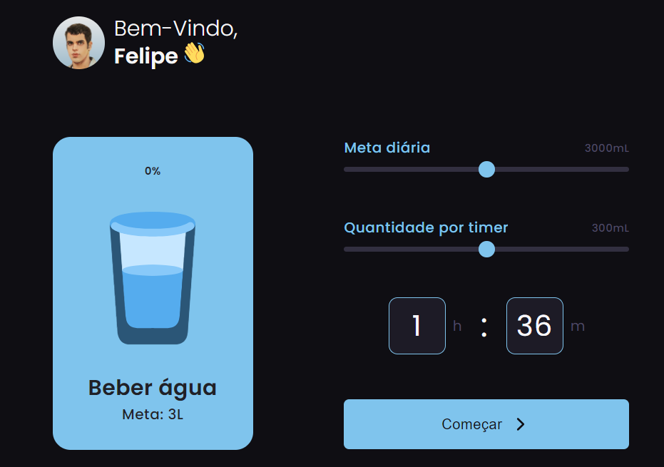

<h1 align="center"> Lembrete para beber água </h1>

 

  

## 🚀 Tecnologias

Esse projeto foi desenvolvido com as seguintes tecnologias:

- HTML
- CSS
- JavaScript

## 💻 Projeto

Desafio 35 do #boraCodar da #Rocketseat. Objetivo era criar um Web App responsivo para lembrar o usuário de tomar água de acordo com as configurações ajustadas por ele.

## 🔖 Layout

Você pode visualizar o layout do projeto através [DESSE LINK](https://www.figma.com/file/j10LdFsUnWV1rquw7iej7o/Reminder-Beber-%C3%81gua-%E2%80%A2-Desafio-35-(Community)?node-id=0%3A1&mode=dev). É necessário ter conta no [Figma](https://figma.com) para acessá-lo.

---